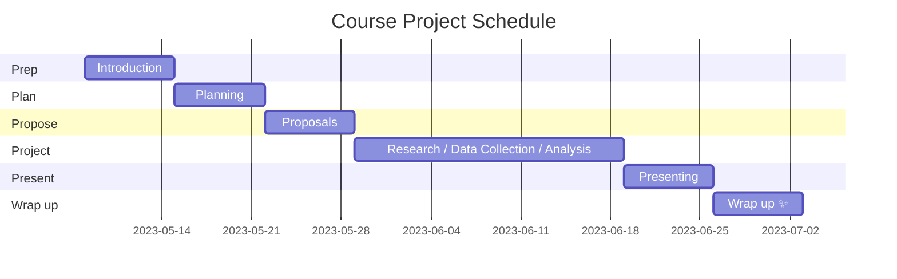

# Neural Control of Real-World Human Movement - 2023 Summer 1
- Instructor: Jonathan Samir Matthis
Course Dates: 8 May 2023 - 27 June 2023
- Format: Online Asynchronous

### Course Materials and Resources
- [Discord Server (Invite behind this link)](https://northeastern.instructure.com/courses/144116/assignments/syllabus)
- [Canvas page](https://northeastern.instructure.com/courses/144116)
- [Course website](https://neuralcontrolhumanmovement-2023-summer1.github.io/main_course_repo/)

## Schedule Overview

|Date| Week | Phase | Plans         |
|----|-------|-----|----------|
| 8 May 2023 | Week 1 | Prep |  Introduction  | 
| 15 May 2023 | Week 2 | Plan |  Training & Literature Review | 
| 22 May 2023 | Week 3 | Propose | Research Planning |
| 29 May 2023 | Weeks 4| Project | Research / Data Collection / Analysis |
|  5 June 2023 | Weeks 5| Project | Research / Data Collection / Analysis |
|  12 June 2023 | Weeks 6| Project | Research / Data Collection / Analysis |
|  19 June 2023 | Week 7 | Present |  Presentating our work to each other |  |
|  26 June 2023 | Week 8 | Pwrap up |  Wrap up and reflections |

## Course Description
In this interdisciplinary course, students will explore the neural basis of natural human behavior in real-world contexts (e.g., sports, dance, or everyday activities) by investigating the neural control of full-body human movement. The course will cover philosophical, technological, and scientific aspects related to the study of natural behavior while emphasizing hands-on, project-based learning. Students will use free open-source machine-learning and computer-vision-driven tools and methods to record human movement in unconstrained environments.

The course promotes interdisciplinary collaboration and introduces modern techniques for decentralized project management, AI-assisted research techniques, and Python-based programming (No prior programming experience is required). Students will receive training in the use of AI technology for project management and research conduct, including literature review, data analysis, and presentation of results. Through experiential learning, students will develop valuable skills in planning and executing technology-driven research projects while examining the impact of structural inequities on scientific inquiry.

!!! note "Course Focus"
    The primary focus is on collaborative work where each student will contribute to a shared research project on their interests/skillsets (e.g. some students will do more programming, others will do more lit reviewing, etc).  
    
## Course Objectives
- Gain exposure to key concepts related to neural control of human movement.
- Apply interdisciplinary approaches when collaborating on complex problems.
- Develop a basic understanding of machine-learning tools for recording human movements.
- Contribute effectively within a team setting towards achieving common goals.
- Acquire valuable skills in data analysis or background research.

## Learning Outcomes
### Design and conduct a research project
- Develop a research plan
- Conduct a literature review
- Compile, analyze, and interpret empirical results
- Present research to a group

### Technical skill development:
#### Markdown text editing
- Software: [Obsidian.md](https://obsidian.md/)
- Web-based tool: [hackmd.io](https://hackmd.io)

#### Basic Github navigation
- Web-based tool: [github.com](https://github.com)

#### Basic Python data analysis

- Software:
  -  [VS Code](https://code.visualstudio.com/) (Primary) 
  -  [PyCharm](https://www.jetbrains.com/pycharm/) (Optional/Advanced)
- Web-based tool: 
  - [Google Colab](https://colab.google.com)

